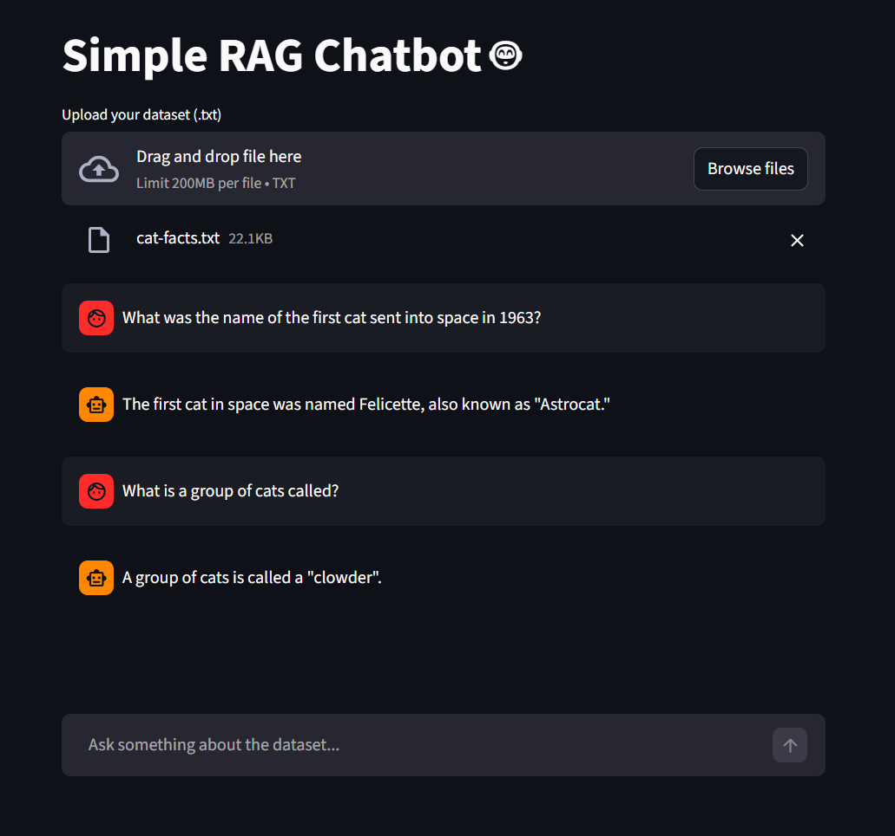

# Simple RAG Chatbot 🤖



## Overview

A Retrieval-Augmented Generation (RAG) chatbot built with Streamlit and Ollama that allows users to upload custom datasets and ask questions based on the provided knowledge. The system combines semantic search with language model generation to provide accurate, context-aware responses.

## What is RAG?

Retrieval-Augmented Generation (RAG) enhances language models by incorporating external knowledge sources. Instead of relying solely on training data, RAG systems:

1. **Retrieve** relevant information from a knowledge base using semantic similarity
2. **Augment** the user's query with retrieved context
3. **Generate** accurate responses based on the combined information

This approach enables chatbots to answer questions about specific domains or datasets that weren't part of the model's original training.

## Features

- 📁 Upload custom text datasets (.txt files)
- 🔍 Semantic search using vector embeddings
- 💬 Interactive chat interface
- 🧠 Context-aware responses using retrieved knowledge
- ⚡ Real-time streaming responses
- 📊 Built-in progress tracking for dataset indexing

## Architecture

The application consists of three main components:

1. **Embedding Model**: Converts text into vector representations for semantic search
   - Model: `bge-base-en-v1.5-gguf`

2. **Vector Database**: In-memory storage for knowledge chunks and their embeddings
   - Uses cosine similarity for retrieval

3. **Language Model**: Generates responses based on retrieved context
   - Model: `Llama-3.2-1B-Instruct-GGUF`

## Installation

### Prerequisites

- Python 3.8 or higher
- [Ollama](https://ollama.com) installed on your system

### Step 1: Install Ollama

Download and install Ollama from [ollama.com](https://ollama.com)

### Step 2: Download Required Models

```bash
ollama pull hf.co/CompendiumLabs/bge-base-en-v1.5-gguf
ollama pull hf.co/bartowski/Llama-3.2-1B-Instruct-GGUF
```

### Step 3: Install Python Dependencies

```bash
pip install -r requirements.txt
```

## Usage

### Running the Streamlit Application

```bash
streamlit run "Rag Application/app.py"
```

### Using the Application

1. **Upload Dataset**: Click "Browse files" and upload a .txt file containing your knowledge base
2. **Wait for Indexing**: The system will process your dataset and build the vector database
3. **Ask Questions**: Once indexing is complete, type your questions in the chat input
4. **Get Answers**: The chatbot will retrieve relevant information and generate responses

### Example Dataset

The project includes a sample dataset (`Notebook/cat-facts.txt`) with 150 cat facts that you can use to test the application.

## Project Structure

```
.
├── Notebook/
│   ├── cat-facts.txt          # Sample dataset (150 cat facts)
│   └── rag.ipynb              # Jupyter notebook with step-by-step implementation
├── Rag Application/
│   ├── app.py                 # Streamlit web application
│   └── requirements.txt       # Python dependencies
└── README.md                  # This file
```

## How It Works

### 1. Indexing Phase

When you upload a dataset:
- The text is split into chunks (one line per chunk)
- Each chunk is converted into an embedding vector using the embedding model
- Chunks and their vectors are stored in the in-memory vector database

### 2. Retrieval Phase

When you ask a question:
- Your query is converted into an embedding vector
- The system calculates cosine similarity between your query and all stored chunks
- Top 3 most relevant chunks are retrieved

### 3. Generation Phase

- Retrieved chunks are added to the system prompt as context
- The language model generates a response based on the context
- Response is streamed back to you in real-time

## Technical Details

### Cosine Similarity

The system uses cosine similarity to measure the semantic similarity between vectors:

```python
def cosine_similarity(a, b):
    dot_product = sum([x*y for x,y in zip(a,b)])
    norm_a = sum([x**2 for x in a]) ** 0.5
    norm_b = sum([x**2 for x in b]) ** 0.5
    return dot_product / (norm_a * norm_b)
```

### Vector Database

Simple in-memory implementation storing tuples of (chunk, embedding):
- Fast for small to medium datasets
- No external dependencies required
- Suitable for prototyping and learning

## Limitations & Future Improvements

- **In-Memory Storage**: Not scalable for large datasets. Consider using Qdrant, Pinecone, or pgvector for production
- **Simple Chunking**: Currently splits by lines. More sophisticated chunking strategies could improve results
- **Single Query**: Could implement multi-query retrieval for complex questions
- **No Reranking**: Adding a reranking model could improve result quality
- **Small Model**: Using a larger language model would improve response quality

## References

This project is based on the tutorial: [Code a simple RAG from scratch](https://huggingface.co/blog/ngxson/make-your-own-rag)

Additional resources:
- [Retrieval-Augmented Generation for Knowledge-Intensive NLP Tasks](https://arxiv.org/abs/2005.11401)
- [AWS: What is RAG?](https://aws.amazon.com/what-is/retrieval-augmented-generation/)
- [Ollama Documentation](https://github.com/ollama/ollama/blob/main/docs)

## License

This project is open source and available for educational purposes.

## Contributing

Contributions are welcome! Feel free to submit issues or pull requests.

---

Built with ❤️ using [Streamlit](https://streamlit.io) and [Ollama](https://ollama.com)


